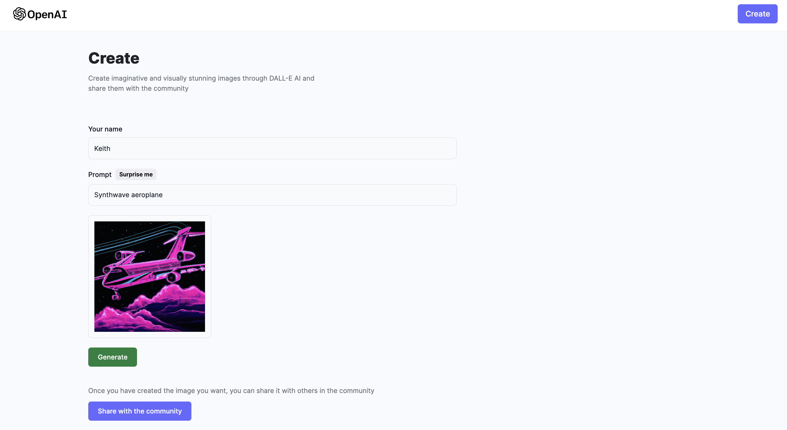

# Image Generation Community

A website that allows users to generate custom images using the OpenAI DALL-E API and submit them to a community showcase that everyone can view. It is run on the MERN stack (inspired by JavaScript Mastery youtube channel) and uses Cloudinary to store image files and netlify to host online.

link to website: [Image Generation](https://charming-smakager-491f0c.netlify.app/)

### Cloning the repository

To clone the repository, open a terminal and enter the following command:
```
git clone https://github.com/matan53153/image-community
```
### Creating a custom image


### Viewing the community image showcase

